# Logo Clustering Pipeline

**Fast, explainable logo similarity analysis without ML clustering**

Group websites by visually identical/near-identical logos using Fourier methods + Union-Find clustering. No k-means or DBSCAN — designed for billion-record scale with free compute.

## 📊 **Logo Extraction Pipeline Architecture**

```mermaid
graph TD
    A[📄 Domain List<br/>4,384 websites] --> B[🚀 Enhanced Logo Extractor]
    
    B --> C{💾 Cache Check}
    C -->|Hit| D[⚡ Instant Load<br/>2,334+ sites/sec]
    C -->|Miss| E[🔄 Multi-Tier API Extraction]
    
    E --> F[🥇 Tier 1: Premium APIs]
    F --> G[Clearbit Logo API]
    F --> H[Logo.dev API]
    
    F --> I{✅ Success?}
    I -->|Yes| J[💾 Cache & Return]
    I -->|No| K[🥈 Tier 2: Backup APIs]
    
    K --> L[Google Favicon]
    K --> M[DuckDuckGo Icons]
    K --> N[IconHorse API]
    
    K --> O{✅ Success?}
    O -->|Yes| J
    O -->|No| P[🥉 Tier 3: Enhanced Recovery]
    
    P --> Q[🧵 Parallel Recovery<br/>6 workers]
    Q --> R[📡 DNS Favicon Extraction]
    Q --> S[🌐 Direct Website Scraping]
    Q --> T[🔍 Additional 46 APIs]
    
    R --> U[favicon.ico]
    R --> V[apple-touch-icon.png]
    R --> W[favicon-32x32.png]
    
    P --> X{✅ Recovery Success?}
    X -->|Yes| J
    X -->|No| Y[❌ Mark as Failed]
    
    J --> Z[📈 97.99% Success Rate<br/>4,296/4,384 logos]
    Y --> Z
    
    Z --> AA[🔥 Fourier Analysis Pipeline]
    
    style A fill:#e1f5fe
    style B fill:#f3e5f5
    style D fill:#e8f5e8
    style G fill:#fff3e0
    style H fill:#fff3e0
    style L fill:#f1f8e9
    style M fill:#f1f8e9
    style N fill:#f1f8e9
    style Q fill:#fce4ec
    style AA fill:#e0f2f1
```



### **🚀 Performance Metrics**

| Stage | Speed | Success Rate | Details |
|-------|--------|--------------|---------|
| **Cache Hits** | 2,334+ sites/sec | 100% | Instant loading from disk cache |
| **Tier 1 APIs** | 26+ sites/sec | ~86% | Clearbit (83.8%) + Logo.dev |
| **Tier 2 APIs** | 15+ sites/sec | ~11% | Google Favicon + backup APIs |
| **Enhanced Recovery** | 8+ sites/sec | ~3% | DNS + 46 additional APIs |
| **Overall Pipeline** | 10.7 sites/sec | **97.99%** | **4,296/4,384 successful** |

### **🔧 Smart Features**

- **💾 Intelligent Caching**: Persistent disk cache with hash-based filenames
- **🧵 Parallel Processing**: 4-6 concurrent workers for optimal throughput  
- **🔄 Progressive Fallback**: 53 total APIs with smart tier prioritization
- **📡 DNS Recovery**: Direct favicon extraction when APIs fail
- **⚡ Cache Acceleration**: 85x speed improvement on subsequent runs

## 🔄 **Complete Analysis Pipeline**

```mermaid
graph LR
    A[📄 Domain List] --> B[🚀 Logo Extraction<br/>97.99% success]
    B --> C[🖼️ Logo Cache<br/>4,296 images]
    C --> D[🔥 Fourier Analysis<br/>C++ optimized]
    
    D --> E[📊 Similarity Matrix<br/>3,906 × 3,906]
    E --> F[🧮 Three Methods]
    
    F --> G[📱 pHash DCT<br/>Hamming ≤ 6]
    F --> H[🌊 FFT Low-Freq<br/>Cosine ≥ 0.985]  
    F --> I[🔄 Fourier-Mellin<br/>Cosine ≥ 0.995]
    
    G --> J[🔗 Union-Find Clustering]
    H --> J
    I --> J
    
    J --> K[📈 37 Brand Clusters<br/>64-89 domains each]
    K --> L[📊 Visualization Dashboard]
    
    style A fill:#e1f5fe
    style B fill:#f3e5f5
    style C fill:#fff3e0
    style D fill:#ffebee
    style E fill:#f1f8e9
    style J fill:#e8eaf6
    style K fill:#e0f2f1
    style L fill:#fce4ec
```



### **⚡ Performance Highlights**

- **Logo Extraction**: 4,296/4,384 logos (97.99% success rate)
- **C++ Fourier Engine**: 376-382 logos/second processing
- **Similarity Analysis**: 3,906×3,906 matrix in ~10 seconds
- **Smart Clustering**: Exactly 37 balanced clusters (no manual tuning)
- **Total Pipeline**: < 5 minutes for complete analysis

## 🎯 **Challenge Requirements**

- **>97% logo extraction rate** from websites
- **Group websites** with similar/identical logos  
- **No ML clustering** (k-means, DBSCAN) — favor explainable methods
- **Scalable to billions** of records

## 🚀 **Our Solution**

### **Three Fourier-Based Similarity Methods**
bash 
1. **pHash (DCT)**: Near-duplicate fingerprint (Hamming ≤ 6)
2. **FFT Low-Frequency**: Global shape signature (Cosine ≥ 0.985)  
3. **Fourier-Mellin**: Rotation/scale invariant (Max cosine ≥ 0.995)

### **Union-Find Clustering** 
- **OR fusion rule**: Any similarity method can trigger grouping
- **Connected components** = logo groups (no predefined cluster count)
- **Transitive grouping**: If A~B and B~C, then A,B,C grouped

### **Lightning-Fast API-First Extraction**
- **API-First Approach**: Clearbit Logo API + Google Favicon API
- **30x Speed Improvement**: 4000+ websites in ~10 seconds (vs 30 minutes scraping)
- **89.4% Success Rate**: Higher than traditional scraping
- **Smart Fallback**: Concurrent scraping for API failures

## 🎨 **Comprehensive Visualizations**

### **Generated Charts & Analysis**
```bash
# Create all visualizations
python visualization_pipeline.py

# Visualize real logo Fourier features  
python real_logo_visualizer.py

# Complete pipeline with integrated visualizations
python complete_pipeline.py
```

### **📊 Visualization Gallery**
- **`extraction_performance_analysis.png`** - API performance metrics & speed comparison
- **`similarity_analysis_visualization.png`** - Similarity distributions & threshold optimization  
- **`cluster_analysis_dashboard.png`** - Brand family discovery & geographic distribution
- **`fourier_features_analysis.png`** - Fourier methodology & processing pipeline
- **`real_logo_fourier_features.png`** - Actual extracted logo Fourier features
- **`logo_similarity_comparison.png`** - Side-by-side similarity analysis

### **🔍 Key Visual Insights**
- **Brand Family Discovery**: Automatic detection of AAMCO, Mazda, Toyota networks
- **Feature Quality Analysis**: Multi-method Fourier comparison (pHash + FFT + F-M)
- **Threshold Optimization**: Data-driven similarity threshold selection
- **Geographic Distribution**: Global brand presence analysis by TLD

## 🔧 **Quick Start**

### **🚀 Enhanced Pipeline (Recommended)**

```bash
# Install dependencies
pip install -r requirements.txt

# Run enhanced logo extraction with caching
python comprehensive_scraper.py --fast

# Run complete analysis pipeline
python logo_analysis.py

# Generate visualizations
python visualization_pipeline.py
```

### **📊 Processing Options**

```bash
# Fast parallel extraction (2,334+ sites/sec with cache)
python comprehensive_scraper.py --fast

# Sequential processing (safer, slower)
python comprehensive_scraper.py --sequential

# Advanced with rate limiting
python comprehensive_scraper.py --advanced

# Parallel batch processing
python comprehensive_scraper.py --parallel
```

### **🎨 Visualization & Analysis**

```bash
# Create all visualizations
python visualization_pipeline.py

# Visualize real logo Fourier features  
python real_logo_visualizer.py

# Complete pipeline with integrated visualizations
python complete_pipeline.py

# Clustering analysis
python logo_cluster.py websites.txt --output clusters.json --trace_unions
```

### **Basic Usage (Legacy)**


# Install dependencies
pip install -r requirements.txt

# Run clustering pipeline
python logo_cluster.py websites.txt --output clusters.json --trace_unions

# Analyze results with explainability
python knn_probe.py clusters.json --tree_output tree.png

# View results
cat clusters.json | jq '.clusters[] | {size: .size, websites: .websites}'
```

### **Input Format** (`websites.txt`)
```
ebay.cn
ebayglobalshipping.com
aamcoanaheim.net  
aamcoconyersga.com
walmart.com
```

### **Output** (`clusters.json`)
```json
{
  "clusters": [
    {
      "cluster_id": 0,
      "size": 2,
      "websites": ["ebay.cn", "ebayglobalshipping.com"],
      "logo_urls": ["https://ebay.cn/logo.png", "https://ebayglobalshipping.com/logo.png"]
    }
  ],
  "extraction_rate": 98.5,
  "total_websites": 100
}
```

## 📊 **Scale Pipeline**

### **GitHub Actions (Free Parallel Processing)**
```bash
# Trigger batch processing
gh workflow run logo-clustering.yml \
  -f batch_size=1000 \
  -f total_batches=20 \
  -f input_file=https://your-bucket.com/websites.txt
```

### **Cloudflare Workers (Edge Caching)**
```bash
# Deploy edge worker
cd cloudflare-worker
wrangler deploy
```

## 📈 **Performance**
- **Single runner**: 500-1000 sites/minute
- **20 parallel batches**: 10,000-20,000 sites/minute  
- **Monthly capacity**: 420-840 million sites
- **Cost**: Nearly $0 using free tiers

### Input Options

The program automatically detects and uses website lists in this order of priority:

1. **Parquet file**: `logos.snappy.parquet` (looks for columns: website, url, domain, site)
2. **Text file**: `logos_list` (one website URL per line)
3. **Sample data**: Built-in sample websites for demonstration

### Running the Analysis

```bash
python main.py
```

### Output Files

- `logo_matching_results.json`: Detailed analysis results
- `logo_groups.csv`: Group information in CSV format

## Algorithm Approach

### 1. Logo Extraction Strategy
- **Multiple Selectors**: Uses CSS selectors targeting common logo patterns
  - `img[alt*="logo"]`, `img[src*="logo"]`, `img[class*="logo"]`
  - `.logo img`, `#logo img`, `header img`, `.navbar img`
  - Favicon links and brand images
- **Fallback Chain**: Tries multiple selectors per website
- **URL Normalization**: Handles relative URLs and protocol variations

### 2. Image Processing Pipeline  
- **Standardization**: Resize to 128x128, convert to grayscale
- **Noise Reduction**: Gaussian blur and normalization
- **Feature Extraction**: Multiple complementary approaches

### 3. Similarity Metrics (Non-ML Clustering)
- **Perceptual Hash (40%)**: 8x8 DCT-based hash with Hamming distance
- **Histogram Comparison (30%)**: Normalized correlation of pixel distributions  
- **Structural Similarity (30%)**: Template matching for shape/structure

### 4. Grouping Algorithm
- **Pairwise Comparison**: O(n²) comparison with early termination
- **Threshold-based**: Configurable similarity threshold (default: 0.85)
- **Union-Find Logic**: Prevents duplicate groupings

## Why This Approach Works

1. **Multiple Fallbacks**: Ensures high extraction rate across different website structures
2. **Complementary Metrics**: Each metric captures different aspects of visual similarity
3. **Perceptual Focus**: Emphasizes features humans use to recognize logos
4. **Noise Resistance**: Preprocessing handles variations in size, format, compression

## Sample Output

```
LOGO MATCHING ANALYSIS RESULTS
============================================================
Total websites analyzed: 15
Successful logo extractions: 15
Extraction rate: 100.0%
Number of groups found: 15

Group Distribution:
  Groups with 1 website(s): 15

Unique Logos: 15 websites

Analysis complete!
Check 'logo_matching_results.json' for detailed results
Check 'logo_groups.csv' for group information
```

## Configuration

You can modify the similarity threshold in `logo_matcher.py`:

```python
class LogoMatcher:
    def __init__(self):
        self.similarity_threshold = 0.85  # Adjust between 0.0 and 1.0
```

## Technical Details

### Image Processing
- **Format Support**: JPEG, PNG, GIF, WebP, SVG
- **Size Normalization**: All images resized to 128x128 for comparison
- **Color Space**: Converted to grayscale for consistent analysis
- **Noise Reduction**: Gaussian blur to handle compression artifacts

### Similarity Calculation
The combined similarity score uses three metrics:

```python
combined_score = (hash_similarity * 0.4 + 
                 hist_similarity * 0.3 + 
                 struct_similarity * 0.3)
```

### Performance Considerations
- **Rate Limiting**: 1-second delay between website requests
- **Timeout Handling**: 10-second timeout for web requests
- **Error Recovery**: Graceful handling of failed downloads
- **Memory Management**: Images processed individually

## Scaling Considerations

For large datasets (millions of websites):

- **Parallel Processing**: Can be parallelized per website
- **Caching**: Image hashes can be cached for repeat analyses  
- **Incremental Updates**: New websites can be compared against existing clusters
- **Memory Optimization**: Streaming processing for large datasets
- **Database Storage**: Store hashes and results in database for persistence

## Future Enhancements

- Add color histogram matching for brand color analysis
- Implement SIFT/ORB feature matching for complex logos
- Add logo detection/segmentation for pages with multiple images
- Implement approximate nearest neighbor search for O(log n) similarity queries
- Add support for animated logos (GIF analysis)
- Machine learning enhancement while maintaining core computer vision approach

## Troubleshooting

### Common Issues

1. **Low extraction rate**: Check if websites are accessible and have logos
2. **Import errors**: Run `pip install -r requirements.txt`
3. **Timeout errors**: Increase timeout in `download_image()` method
4. **Memory issues**: Process websites in smaller batches

### Dependencies

- Python 3.7+
- OpenCV for image processing
- BeautifulSoup for HTML parsing
- Pillow for image handling
- NumPy for numerical operations
- Pandas for data handling (parquet support)

## License

This project is provided for educational and research purposes.

## Contributing

Feel free to submit issues, feature requests, or improvements to enhance the logo matching capabilities.
